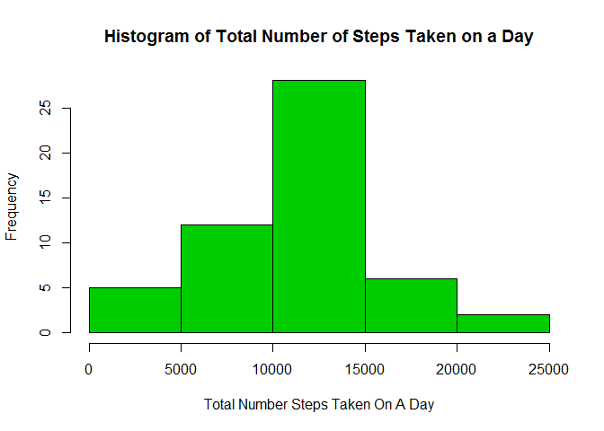
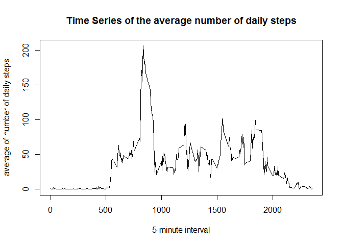
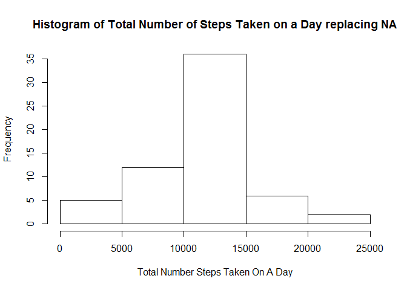
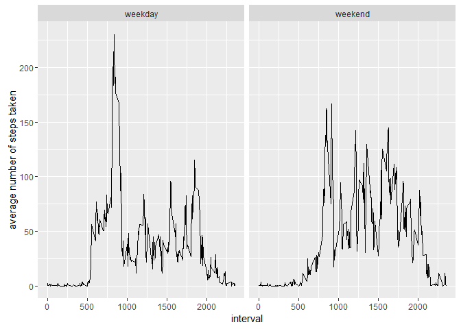

# Reproducible Research: Peer Assessment 1

We are dealing with data from a personal activity monitoring device. This device collects data at 5 minute intervals through out the day. The data consists of two months of data from an anonymous individual collected during the months of October and November, 2012 and include the number of steps taken in 5 minute intervals each day.

First include the knitr library for a few basic options


```r
library(knitr)
opts_chunk$set(fig.path = "./figure/")
```

We shall use the dplyr package to work better with data frames and ggplot2 to print graphs.

```r
library(ggplot2)
library(dplyr)
```

## Loading and preprocessing the data

### Load the data
First step is loading the data. The following code reads the csv file "activity.csv" inside the zip.

```r
dat <- read.csv(unz("activity.zip","activity.csv"))
```

### Process/transform the data 
Now we preprocess the data. First by converting to a tbl data frame and then by converting date from a factor to time.

```r
#convert to tbl_df
data_df <- tbl_df(dat)
#convert date from factor to time
data_df <- data_df %>% 
    transmute(steps, date = as.POSIXct(strptime(date, "%Y-%m-%d")), interval) 
```

## What is mean total number of steps taken per day?

For this part of the assignment, we ignore the missing values in the dataset.

```r
data_dfNoNA <- na.omit(data_df)
```
First we create a new data set where we group the data by day and then summarise to compute the sum.


```r
#daily total number of steps
totalStepsDay <- data_dfNoNA %>% group_by(date) %>% summarize(Total = sum(steps, na.rm = TRUE))
```

### Make a histogram of the total number of steps taken each day

```r
hist(totalStepsDay$Total, xlab = "Total Number Steps Taken On A Day", 
     main = "Histogram of Total Number of Steps Taken on a Day", col = 3)
```



### Mean and median total number of steps taken per day

```r
options(scipen=999)
totalMean <- mean(totalStepsDay$Total)
totalMedian <- median(totalStepsDay$Total)
```

Concerning the total number of steps taken per day, its mean is 10766.1886792 while its median is 10765.

## What is the average daily activity pattern?

Now we perform a similar transformation as the previous item, but we group by interval and then compute the average.

```r
avgStepsInt <- data_dfNoNA %>% group_by(interval) %>% summarize(AverageNo = mean(steps, na.rm = TRUE))
```

### Time series plot of the 5-minute interval and the average number of steps taken, averaged across all days


```r
plot(avgStepsInt$interval, avgStepsInt$AverageNo, type = "l", xlab = "5-minute interval", ylab = "average of number of daily steps", main = "Time Series of the average number of daily steps")
```



### 5-minute interval that contains the maximum number of steps

I wish to compute the maximum value and where does that maximum take place, so i will use the filter function to check where the maximum takes place

```r
max <- avgStepsInt %>% filter(interval, AverageNo == max(AverageNo))
maxElement <- max[[1,1]]
maxValue <- max[[1,2]]
```
The 5-minute interval, on average across all the days in the dataset, that contains the maximum number of steps is 835 which has an average of 206.1698113 daily steps.

## Imputing missing values

### Calculate the total number of missing values in the database


```r
numberNA <- sum(is.na(data_df$steps))
```
There are 2304 NA values in our database.

### Devise a strategy for filling in all of the missing values in the dataset. Create a new dataset with the missing data filled

The strategy was to replace an NA with the number of steps on that interval averaged across all days.

```r
newData <- data_df %>% 
    group_by(interval) %>% #group to compute the average
    mutate(newStepValue = ifelse(is.na(steps), mean(steps, na.rm = TRUE),steps)) %>%
    #replace NA by mean, otherwise just return the existing value
    select(steps = newStepValue, date, interval) %>% #update columns
    ungroup()
```

###Analysis of new values

```r
newTotalStepsDay <- newData %>% group_by(date) %>% summarize(Total = sum(steps, na.rm = FALSE))

hist(newTotalStepsDay$Total, xlab = "Total Number Steps Taken On A Day", 
     main = "Histogram of Total Number of Steps Taken on a Day replacing NA")
```



```r
newMean <- mean(newTotalStepsDay$Total)
newMedian <- median(newTotalStepsDay$Total)
```
Following the same steps in the construction of the first histogram, we see that one of the bins increased. The new values of the mean and median are 10766.1886792 and 10766.1886792 respectively, which is the same mean value but a slightly different median value.

Looking a little bit further in which days the NA values appear.

```r
dataWithNA <- data_df %>% filter(., is.na(steps)) %>% group_by(date) %>% summarise(count = n())
dataWithNA
```

```
## Source: local data frame [8 x 2]
## 
##         date count
##       (time) (int)
## 1 2012-10-01   288
## 2 2012-10-08   288
## 3 2012-11-01   288
## 4 2012-11-04   288
## 5 2012-11-09   288
## 6 2012-11-10   288
## 7 2012-11-14   288
## 8 2012-11-30   288
```
We see that when a day has an NA, the entire day is filled with NA, which means that there were some days that had total 0 because there wasn't any observation on that day.

Therefore replacing NA with this mean value does not change the value of the mean and the median, but does change the histogram, since that if we replace NA with values we will have more days with values.


## Are there differences in activity patterns between weekdays and weekends?

### Create a new factor variable to represent weekend

We shall create a new factor variable that takes the label weekend when "weekend" returns either Saturday or Sunday and "weekdays" otherwise.

```r
newDataWithWD <- newData %>% 
    mutate(weekday = factor(weekdays(date) %in% c("Saturday","Sunday"), 
                                    labels = c("weekday","weekend")))
```

### Panel plot containing a time series plot of the 5-minute interval and the average number of steps taken, averaged across all weekday days or weekend days 

First we will use the dataset with the NA values replaced by the number of steps on that interval averaged across all days.
We shall group the data by the factor weekday and by interval and then compute the mean number of steps across each group of days.

```r
avgWD <- newDataWithWD %>% group_by(weekday, interval) %>% summarize(average = mean(steps))
```

The plot is then created using ggplot, with interval in the x-axis, average number of steps in the y-axis and the factor weekday as the facet.

```r
ggplot(avgWD, aes(interval, average)) + geom_line() + facet_grid(. ~ weekday) + ylab("average number of steps taken")
```


